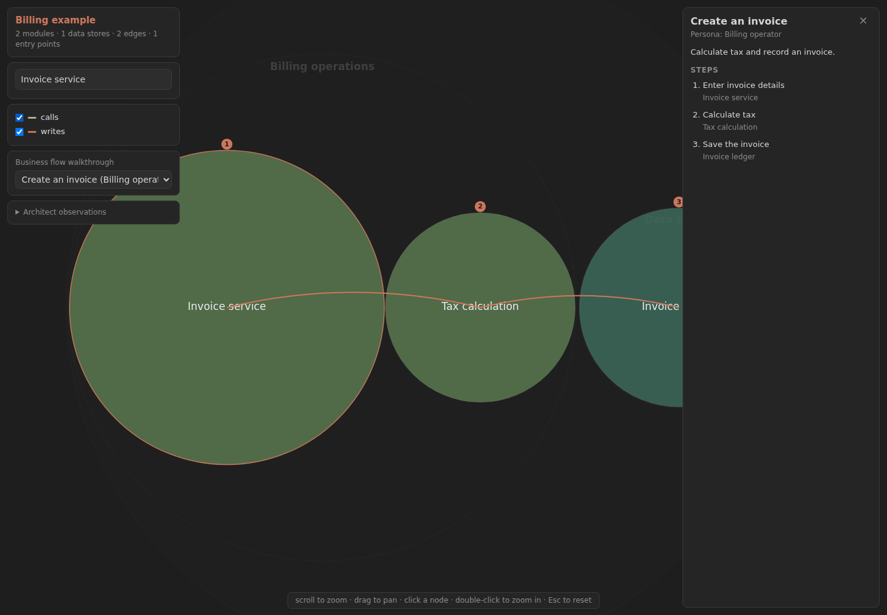

# Codex Modernize

Modernize a legacy codebase with **ten native Codex skills**: readiness checks,
assessments, interactive architecture maps, business rules, phased plans,
cross-stack rewrites, greenfield scaffolds, version upgrades, security patches,
and progress reports.

This is an independent Codex adaptation of Anthropic's
[code-modernization plugin](https://github.com/anthropics/claude-plugins-official/tree/db467cc56673fc963ca418b4165c688dfbe77007/plugins/code-modernization).
It uses Codex's plugin and skill formats, native tools, and optional subagents.
No Claude installation, Anthropic API key, MCP server, or external workflow
runtime is required.

## Install

Use a Codex CLI that supports `codex plugin` (tested with **0.155.1**):

```sh
codex plugin marketplace add DevilsNerve/codex-modernize
codex plugin add codex-modernize@codex-modernize
```

Start a **new Codex session** in the project you want to modernize. Select a skill
in the picker or invoke its full name in a prompt:

```text
$codex-modernize:modernize-preflight billing
```

The `$...` examples are **Codex prompts, not shell commands**. Codex namespaces
installed plugin skills as `codex-modernize:modernize-*`. You can also ask in
plain language: “Use Codex Modernize to assess the billing system.”

For a local checkout:

```sh
git clone https://github.com/DevilsNerve/codex-modernize.git
codex plugin marketplace add ./codex-modernize
codex plugin add codex-modernize@codex-modernize
```

The marketplace can also be browsed through Codex's `/plugins` UI. See the
[official plugin documentation](https://developers.openai.com/plugins/build/plugins)
for host and marketplace details.

## Workspace and quickstart

Python **3.10+** runs the bundled helpers. On hosts using `python` or `py -3`, use
that launcher in place of `python3`. Node.js is only needed for this repository's
optional browser tests, not for using the plugin.

The workflow keeps source, analysis, and generated code in separate directories:

```text
your-workspace/
  legacy/billing/          existing source, kept unchanged
  analysis/billing/        reports, topology, rules, brief, evidence
  modernized/             transformed, rebuilt, or upgraded code
```

`legacy/billing` may be a directory or a link to your existing checkout. Use a
simple system name containing letters, numbers, hyphens, or underscores. Do not
run Codex from the installed plugin directory; run it from your workspace.

Start with discovery, then choose the implementation method that fits:

```text
$codex-modernize:modernize-preflight billing
$codex-modernize:modernize-assess billing
$codex-modernize:modernize-map billing
$codex-modernize:modernize-extract-rules billing
$codex-modernize:modernize-brief billing java-spring
$codex-modernize:modernize-transform billing interest-calc java-spring
$codex-modernize:modernize-harden billing
$codex-modernize:modernize-status billing
```

Each stage can be reviewed and resumed separately. Existing user authorization
is honored; unresolved scope or behavior decisions are raised against concrete
artifacts. An assessment request does not silently become an implementation task.

## Skills

All names below have the installed prefix `$codex-modernize:`.

| Skill and arguments | Result |
| --- | --- |
| `modernize-preflight <system> [target-stack]` | `PREFLIGHT.md`: toolchains, real build readiness, source completeness, human context, and external consumers |
| `modernize-assess <system> [--show-secrets]` | `ASSESSMENT.md`, `ARCHITECTURE.mmd`: inventory, debt, security, and recommendations |
| `modernize-assess --portfolio <parent-dir>` | `portfolio.html`: comparable system metrics and sequencing |
| `modernize-map <system>` | `topology.json`, offline `TOPOLOGY.html`, reproducible extraction script, Mermaid diagrams |
| `modernize-extract-rules <system> [module-pattern]` | Cited Rule Cards in `BUSINESS_RULES.md` and `DATA_OBJECTS.md` |
| `modernize-brief <system> [target-stack]` | `MODERNIZATION_BRIEF.md`: phases, entry/exit criteria, behavior contract, approval scope |
| `modernize-transform <system> <module> <target-stack>` | One cross-stack rewrite with characterization tests and `TRANSFORMATION_NOTES.md` |
| `modernize-reimagine <system> <target-vision...>` | Specification, reviewed architecture, service scaffolds, acceptance tests, `AGENTS.md` |
| `modernize-uplift <system> <source-version> <target-version> [project-pattern] [--catalog-only]` | Delta catalog, baseline, proven pilot, playbook, dependency-ordered upgrades, `UPLIFT_NOTES.md` |
| `modernize-harden <system> [--show-secrets]` | Verified security findings and reviewable patches; source remains unchanged |
| `modernize-status <system>` | Read-only artifact inventory, staleness, credential-file hygiene, next step |

**Transform** rewrites one module into another stack. **Reimagine** designs a new
system from the extracted behavior. **Uplift** preserves the existing structure
and changes only what the new version requires.

For a same-stack upgrade, produce its delta catalog before writing the brief:

```text
$codex-modernize:modernize-uplift billing ".NET Framework 4.8" ".NET 8" --catalog-only
$codex-modernize:modernize-brief billing ".NET 8"
$codex-modernize:modernize-uplift billing ".NET Framework 4.8" ".NET 8"
```

Catalog-only mode does not create a migration copy or start implementation.
Version pairs are examples; choose and verify the target appropriate to your
system. A missing legacy runtime changes the strength of the equivalence proof
and is reported explicitly.

## Architecture viewer

The interactive viewer includes its D3 subset. Generated files work offline,
including search, zoom/pan, node details, edge filters, and persona walkthroughs.
Topology JSON is validated and escaped before embedding it in HTML.



## Execution and evidence

Eight specialist role guides support the skills. Codex runs their passes
sequentially or uses available native subagents when the session permits it.
The plugin does not select a model, start an external agent runner, or silently
increase host concurrency. Independent review is only claimed when it occurred.

Uplifts begin with a real pilot. Subsequent units follow its playbook in dependency
order. Failed dependencies block consumers; a batch with fewer than two-thirds
successful builds stops expansion until the playbook is repaired. Shared files
have one owner, and the calling session checks the final integrated build.

The helpers refuse output-path escapes, symlinked outputs, unknown dependencies,
overlapping unit directories, cyclic plans, and overwriting an existing upgrade
copy. They do not sandbox arbitrary shell commands: the Codex host's permissions
still apply. Builds that write files run in working copies, not the legacy tree.

Credentials are masked in shared artifacts. Local credential inventories and
credential-removal patches are quarantined and checked against Git tracking and
history. `--show-secrets` permits raw values only in the private ignored inventory.
The plugin does not apply security patches, publish, or deploy unless the user
separately requests those actions.

Passing tests only establish the behavior they cover. Reports distinguish live
dual execution, recorded traces, source-derived expectations, skipped tests,
and missing runtime or SME evidence. COCOMO figures are relative size indices,
not schedule or cost promises.

## Validation and development

From this repository:

```sh
python3 scripts/validate.py
npm ci
npx playwright install chromium
npm run test:viewer
```

After installing the plugin, verify actual discovery without making a model call:

```sh
python3 scripts/check_codex.py
```

The test suite covers path boundaries, untouched source copies, offline HTML
rendering and script injection, migration ordering/retries, credential quarantine,
and read-only status. Browser tests exercise the real viewer. GitHub Actions runs
the package and browser checks. See [porting notes](docs/PORTING.md) for parity,
provenance, and validation scope.

## License

Your original [PolyForm Noncommercial license](LICENSE.md) is retained for the
Codex adaptation contributions. Upstream-derived material retains Apache-2.0;
the bundled D3 subset retains ISC. See the packaged
[attribution and notices](plugins/codex-modernize/NOTICE.md). This project is not
an official OpenAI or Anthropic product.
